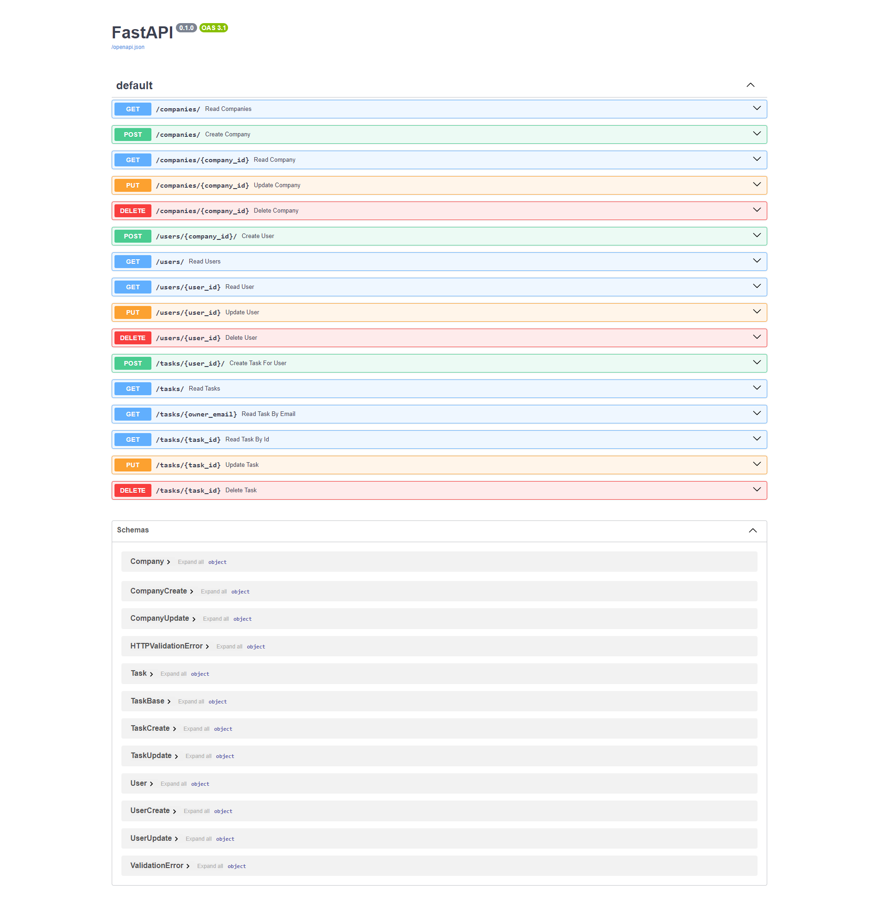

## Overview

This is a pool where I can swim with multiple Python frameworks.

## Prerequisites

Before begin, ensure we have the following prerequisites installed:

- Python 3.10+
- PostgreSQL
- pip (Python package installer)

## Getting Started

To get started with the tutorial, follow these steps:

1. Clone the repository to your local machine:
   git clone https://github.com/AkaTVT711/python-practical
   cd python-practical


2. Creates a virtual environment named 'env'
   virtualenv env


3. Set up a virtual environment

- via WSL:
  ```
  source env/bin/activate
  ```

4. Install dependencies:
   ```
    pip3 install psycopg2-binary
    pip3 install psycopg2
    pip3 install -r requirements.txt
    ```

5. Initialize the database schema:
   ```
    alembic upgrade head
   ```

6. Run the FastAPI application:
   ```
   uvicorn app.main:app --reload
   ```

7. Open your web browser and navigate to `http://localhost:8000/docs` to access the interactive API documentation (
   Swagger UI).

## Project Structure

The project structure is organized as follows:

```bash
  python-practical/
    ├── alembic/                 # Directory for database migrations
    │   └── versions/            # Directory containing Alembic migration scripts
    ├── app/                     # FastAPI application directory
    │   ├── __init__.py          # Package initialization file
    │   ├── crud.py              # File containing CRUD operations for database models
    │   ├── database.py          # File containing database setup and operations
    │   ├── main.py              # Main FastAPI application file defining routers
    │   ├── models.py            # File defining database models using SQLAlchemy ORM
    │   └── schemas.py           # File defining Pydantic models
    ├── requirements.txt         # File containing project dependencies
    ├── alembic.ini              # Alembic configuration file
    └── README.md                # Project README file
```
